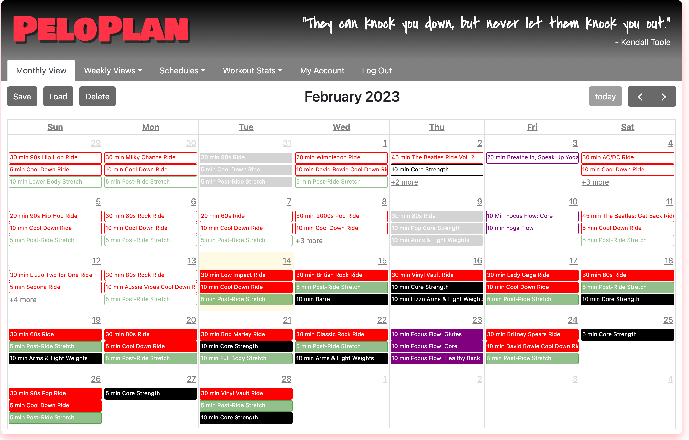
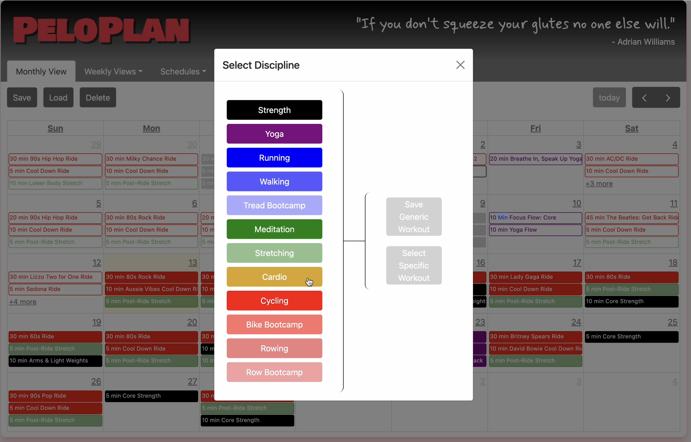
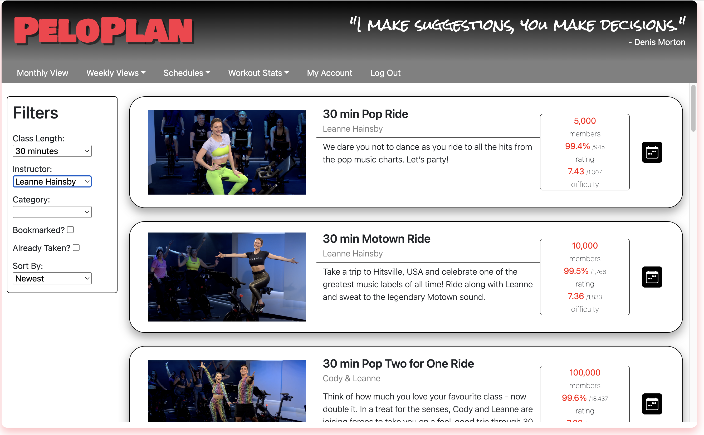
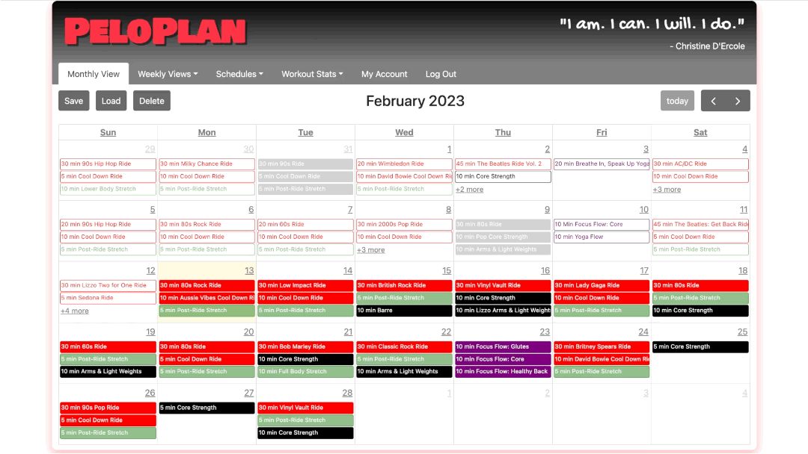
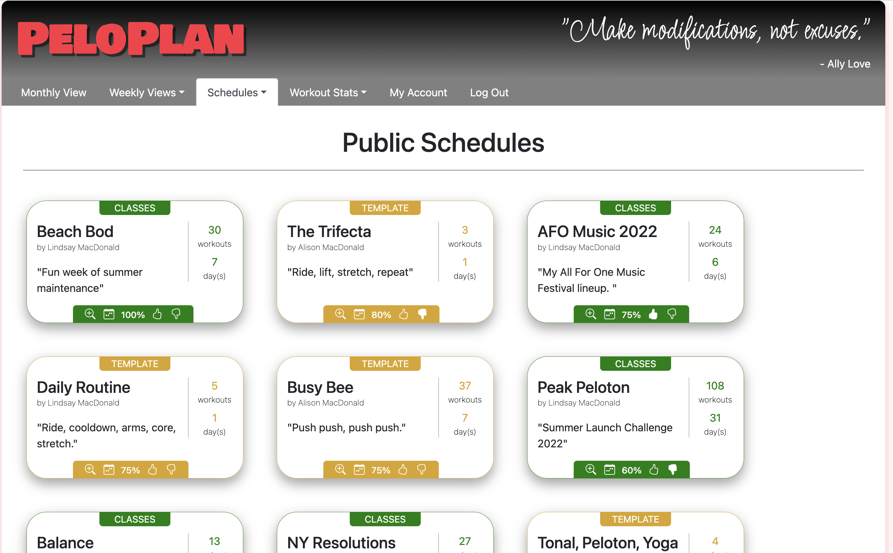
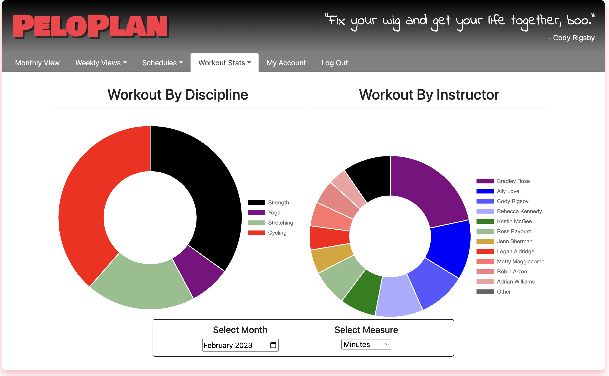
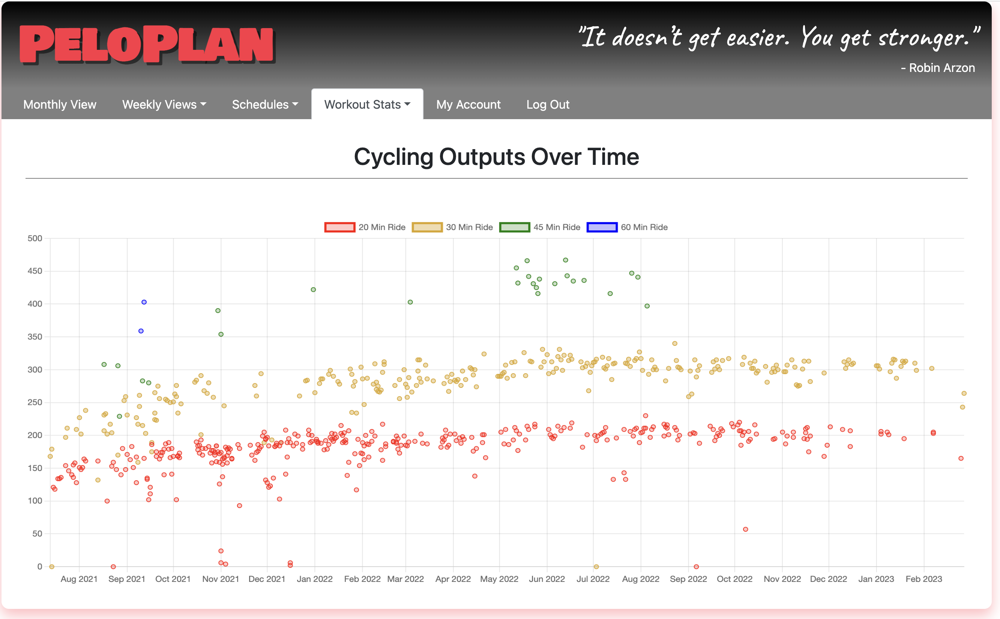

# PeloPlan

A workout planning and schedule sharing app for Peloton users.

## Technologies
- Backend: Python, Flash, PostgreSQL, SqlAlchemy 
- Frontend: JavaScript, React, AJAX, JSON, Chart.js, HTML, CSS, Flexbox, Bootstrap
- API: Peloton API

## Features

*Please find my full <a href='https://www.youtube.com/watch?v=wR8js2b2S1I' target='_blank'>Demo Video</a> on YouTube.*

- After a user connects to their Peloton account, PeloPlan displays a calendar of their workout history.




- They can then build their schedule with classes from the Peloton course catalog or generic workouts that can be decided on later. 
<p></p>


- They can track their progress over time to see whether they are sticking to their PeloPlan.  


  

- Users can reuse or share their schedules as well as rate other users’ publicly shared schedules and load them on their own calendar.  




- They can view their workout history broken down by discipline and instructor and track their cycling outputs over time. 
<p></p>

- And finally, users can search for their friends by name or email and follow them to share schedules on PeloPlan.


## Set Up
*Please note that you will need to connect to a Peloton account to use this app*

1. Clone the git repository <br/>
```bash 
    git clone https://github.com/linzmacd/peloplan.git 
```

2. Create and activate a virtual environment inside the directory<br/>
```bash 
    create virtualenv env
    source env/bin/activate
```

3. Install requirements <br/>
```bash 
    pip3 install -r requirements.txt
```

4. Run server  <br/>
```bash
    python3 server.py
```

## About Me

Hi! I'm Lindsay, a freshly minted software engineer having recently completed an immersive 12-week full-stack software engineering fellowship at Hackbright Academy. I originally studied bioengineering and business at UC Berkeley and worked in biotech for the better part of a decade before moving into a management role in the hospitality industry. The only constant throughout my career has been my perpetual drive to make things better, be it through problem-solving, improving efficiency, reducing waste, or eliminating redundancies. I look forward to bringing that same curiosity and determination into the next chapter of my career as a software engineer. I hope you enjoyed my web application and demo, please feel free to connect if you have any questions or feedback. Thank you!